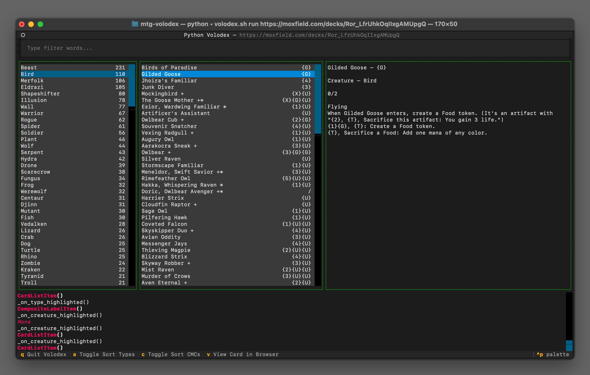

# Volodex, Commander Companion App

The `volodex` is a CLI companion app to discover new creatures for your [Volo, Guide to Monsters](https://scryfall.com/card/afr/238/volo-guide-to-monsters) Commander deck.
It helps you discover and find creatures whose types are not currently in your decklist.


## Table of contents

- [Prerequisites](#prerequisites)
- [Getting Started](#getting-started)
- [Usage](#usage)
- [Caching](#caching)


> [!NOTE]
> This code was written specifically to solve my unique requirements, use cases and workflows. It may not follow the most optimal practices or be universally applicable.
> 
> If you find the code useful for your purposes, feel free to use or modify it as needed. However, I cannot guarantee its suitability for any use case other than my own. Use at your own discretion! 😊





## Prerequisites

Before using the `volodex`, you will need:
- `python >= 3.x`


## Dependencies

The `volodex` uses the following python packages:
- [click](https://pypi.org/project/click/)
- [more-itertools](https://pypi.org/project/more-itertools/)
- [requests](https://pypi.org/project/requests/)
- [mtg-parser](https://pypi.org/project/mtg_parser/)
- [textual](https://pypi.org/project/textual/)
- [tqdm](https://pypi.org/project/tqdm/)


You don't need to manually install them, this is done when executing `./install.sh`.

Cards database is fetched from the [mtgjson.com](https://mtgjson.com) api.


## Getting Started


### Install the app

Create the virtual environment and install the dependencies:

```Shell
$ ./install.sh
```


### Setup the card database

Download the card database from [mtgjson.com](https://mtgjson.com) and filter it:

```Shell
$ ./volodex.sh download
$ ./volodex.sh update
```

See also [Caching](#caching).


### Launch the application

Launch the cli `volodex` application:

```Shell
$ ./volodex.sh run [DECKLIST_URL]
```

If the `volodex` is launched with a decklist, creature types will be filtered to only show the ones that are not already included in the deck.

If the `volodex` is launched with no argument, all creatures elligible for a [Volo, Guide to Monsters](https://scryfall.com/card/afr/238/volo-guide-to-monsters) Commander deck will be listed.

The `volodex` relies on [mtg-parser](https://pypi.org/project/mtg_parser/) for parsing decklists and thus, supports the same deck building websites.


## Usage


### Interface

The `volodex` user interface is composed of several panels.
1. **Filters** (top panel): Allows you to filter cards that contain specific words (eg. `draw`, `token`, `enters`, etc.). Press `enter` to validate and update the available creatures.
2. **Creature types** (left panel): Lists available creature types and the number of creatures for this type. If a creature has multiple types, its counted several times.
3. **Creatures** (center panel): Lists the creatures and their mana value for the selected type. Several "add-ons" can be displayed at the end of the creature name:
    - `'+'` this creature has multiple sub-types
    - `'*'` this creature is legendary
4. **Creature details** (right panel): Displays basic information for the selected creature (name, mana value, type, power/toughness, oracle text).
5. **Debug** (bottom panel): Will probably be removed at some point. Displays basic debugging information.


### Features and Commands

Here's a list of the different interactions:
- `tab`: Cycle through panels
- `q`: Quit the `volodex`
- `a`: Toggle sorting of creature types between alphabetical order and number of creatures in the type.
- `c`: Toggle sorting of creatures between mana value and popularity (EDHRec Rank).
- `v`: Opens the scryfall page for the selected creature in your browser.

> [!NOTE]
> Apart from `tab`, the other interactions cannot be done while the focus is on the Filter panel.


## Caching

The `volodex` creates two local cache files.
- `./AtomicCards.json.xz` is fetched from [mtgjson.com](https://mtgjson.com) when running the `./volodex.sh download` command. This file contains the list of all mtg cards.
- `./volodex.json` is created/updated when running the `./volodex.sh update` command. This file only contains the relevant cards for a [Volo, Guide to Monsters](https://scryfall.com/card/afr/238/volo-guide-to-monsters) Commander deck.
